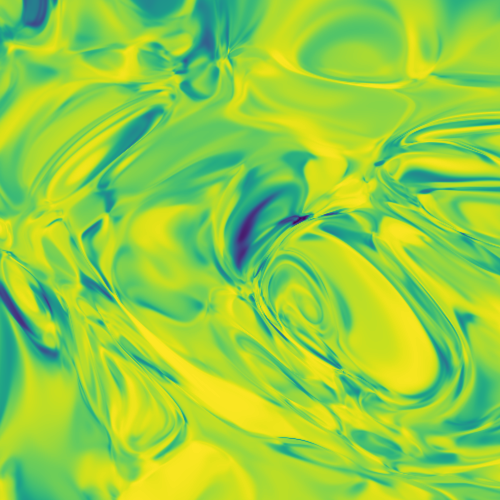
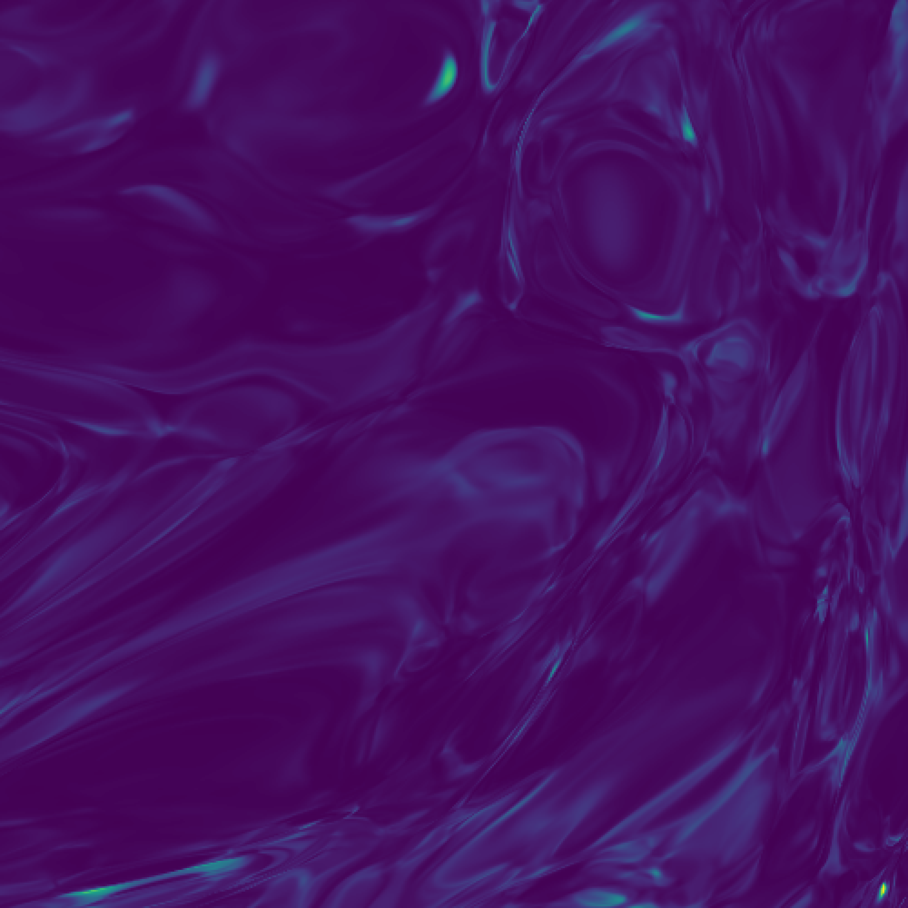

> 🎥 Recorded video: <a href="https://www.video.uni-erlangen.de/clip/id/10611" target="_blank">Lecture 1</a>  
> 🗓 Online session introducing the course: April 28, 6pm (please watch the video before)

## Description

Contents: Introduction (the power of deep neural networks in applications), brief discussion of the lecture outline, structure of a neural network and information processing steps, very brief introduction to python and jupyter, implementing a deep neural network efficiently in basic python (without any additional packages like tensorflow), illustration: complicated functions generated by deep neural networks

After this lecture, you will know the basic structure of a neural network and how to implement the 'forward-pass' in python, but you don’t yet know how to adapt the network weights (training).

## Code

#### From lecture:

This notebook shows how to calculate the forward-pass through a neural network in pure python, and how to illustrate the results for randomly initialized deep neural networks (as shown in the lecture).

If turns out to be better for you, you can run all the notebooks directly on the cloud using Google Colab.

- The jupyter notebook with the code for this lecture can be found here: [Download](../notebooks/01_MachineLearning_Basics_NeuralNetworksPython.ipynb) 
  
- An improved version of the above notebook can be found here: [Download](../notebooks/01 - Neural Networks with pure Python.ipynb)  
  

#### From tutorial:

The "Network Visualization" notebook shows how to visualize arbitrary multilayer networks (with two inputs and 1 output neuron, so the result can be displayed in the plane), including a visualization of the network structure.

- Notebook: [Download](../notebooks/01_tutorial_NetworkVisualization.ipynb) 
  

The "Curve Fitting" notebook visualizes nonlinear curve fitting for a 1D function with a few parameters, via stochastic gradient descent. This is useful to understand what is going on in the higher-dimensional case of neural networks, where essentially the same concept is applied. We did not get around to trying this out during the online tutorials, but please try it and ask questions or present your results [on the forum](https://groups.google.com/forum/#!forum/machine-learning-for-physicists)!

- Notebook: [Download](../notebooks/01_tutorial_CurveFitting.ipynb) 
  

## Homework

_The solutions will be briefly discussed in the online session for lecture 2. In order to follow the lecture series, please do at least two of these problems (the ones with the * are suggested)._

1. (\*) Implement a network that computes `XOR` (arbitrary number of hidden layers).
2. Implement a network that approximately computes `XOR`, with just 1 hidden layer 
  > Hint: there is something useful at the end of the "Visualization" notebook above.
3. (\*) Visualize the results of intermediate layers in a multi-layer randomly initialized NN (meaning: take a fixed randomly initialized multi-layer network, and then throw away the layers above layer $$n$$; and directly connect layer $$n$$ to the output layer; see how results change when you vary $$n$$. (You can start from [this notebook](../notebooks/01_MachineLearning_Basics_NeuralNetworksPython.ipynb).)
4. What happens when you change the spread of the random weights? Smart weight initialization is an important point for NN training.
5. Explore cases of curve fitting where there are several (non-equivalent) local minima. Is sampling noise helpful (i.e. the noise that comes about because of the small number of $$x$$ samples)?

### Homework solutions

For this homework, I packed the neural network operations from the tutorial in the script [neural_net_01.py](../scripts/neural_net_01.py), which is used to solve the exercises for this homework. To check my solutions of the homework, open the notebook directly from the following button link:  

## Extra

An example of the output images generated with the code provided above can be seen here:

